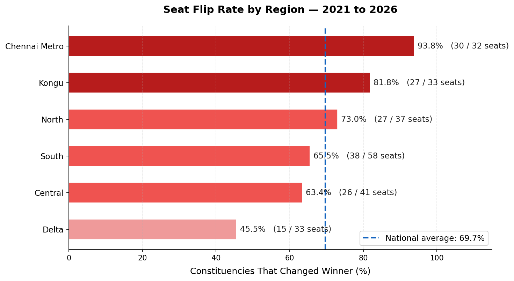
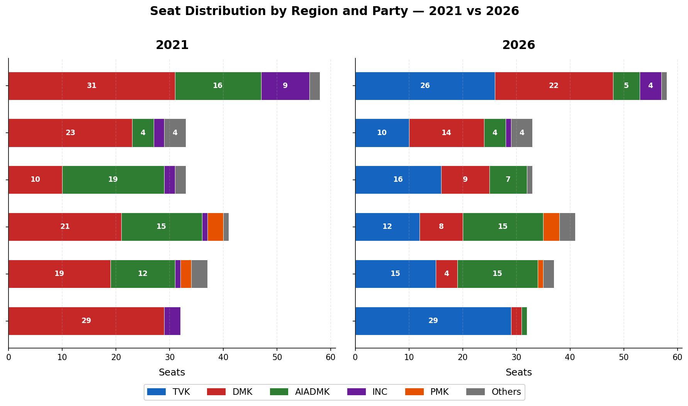
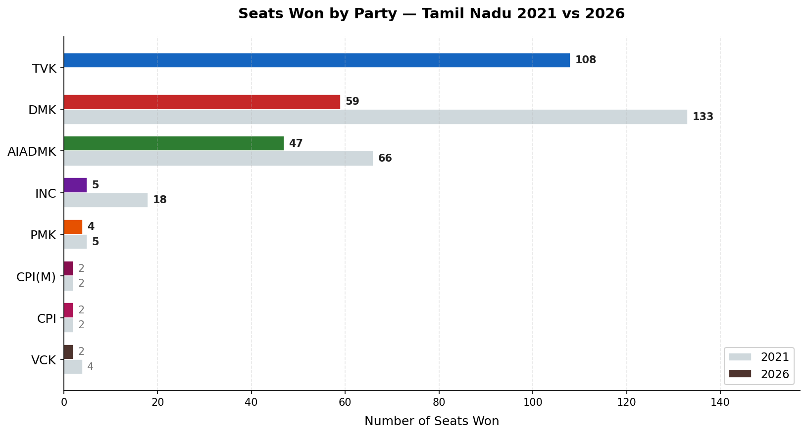
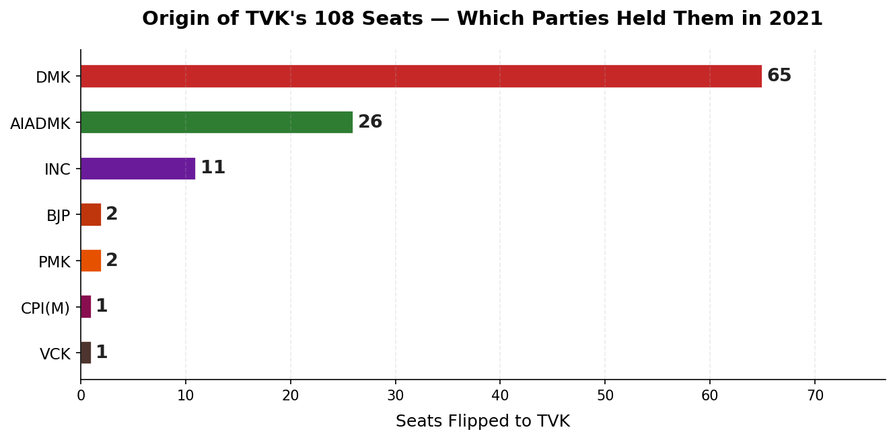
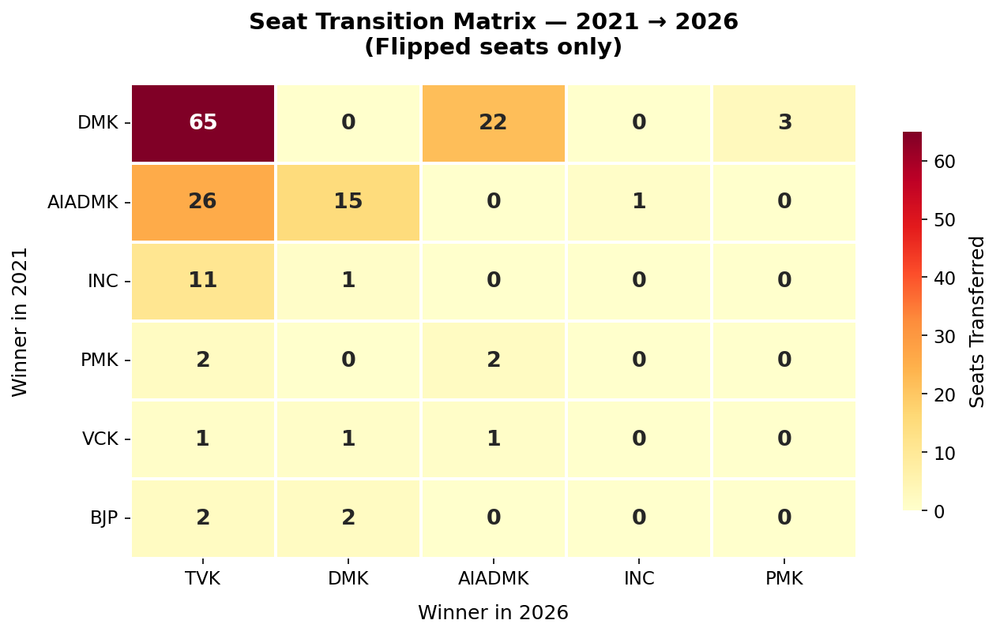
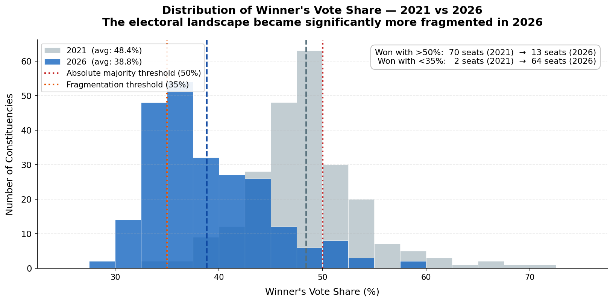
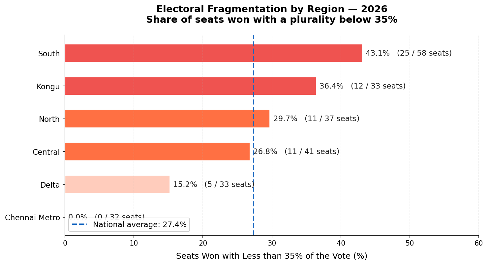
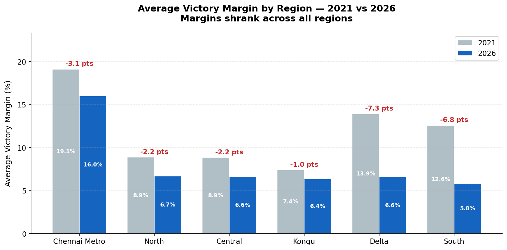
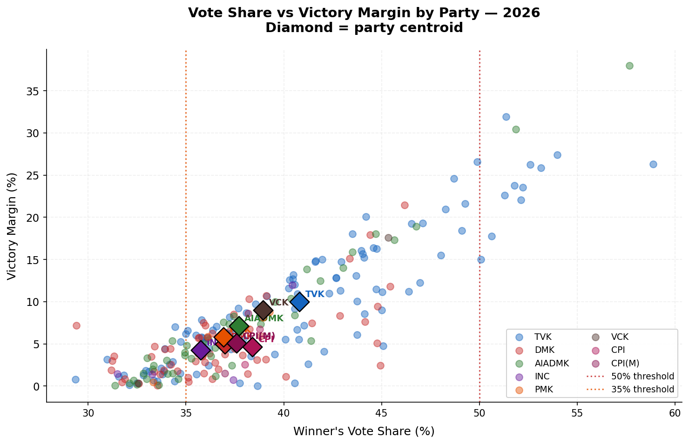

# Decoding the 2026 Tamil Nadu Assembly Election

**Codebasics Resume Project Challenge #21 — AtliQ Media**

---

## The Brief

AtliQ Media is producing a one-hour prime-time special on the 2026 Tamil Nadu Assembly Election. The editorial team needs three data-driven story segments, each compelling enough to hold a general-audience viewer for seven minutes. The directive: use only public Election Commission of India data, stay politically neutral, and make the numbers mean something to someone who has never read an election results sheet.

This project identifies the three most significant electoral patterns in the data, quantifies them, and builds the visual evidence for each.

---

## Executive Summary

> *In a single election, Tamil Nadu rewrote its political map. 163 of 234 constituencies changed their winning party. A party that did not exist five years ago captured 108 seats. And across the state, the era of dominant majorities quietly ended — replaced by a new fragmented normal where winning 38% of the vote is enough to take a seat.*

Three stories explain how this happened.

---

## Story 1 — The New Map

**The question:** Where did the change happen, and how deep did it go?

The headline number is 163 flips out of 234 constituencies — a **69.7% turnover rate**. But the geographic breakdown shows this was not uniform.



Chennai Metro was the epicentre: **30 out of 32 seats** changed hands, a 93.8% flip rate — the highest of any region. In contrast, the Delta region remained the most stable, with only 45.5% of seats changing winner, anchored by DMK holding 14 of its 33 seats.



| Region | Seats | Flip Rate | 2026 Dominant Party |
|---|---|---|---|
| Chennai Metro | 32 | **93.8%** | TVK |
| North | 37 | 75.7% | TVK |
| South | 44 | 72.7% | TVK |
| Central | 38 | 68.4% | TVK |
| Kongu | 50 | 68.0% | TVK |
| Delta | 33 | **45.5%** | DMK |

The story is not just that change happened — it is how total that change was in some places, and how contained it remained in others.

---

## Story 2 — The Rise of TVK and the Collapse of the Old Order

**The question:** Which parties gained, which lost, and where did the seats actually come from?



The headline shift is stark. DMK collapsed from **133 seats to 59** (−74). AIADMK fell from **66 to 47** (−19). TVK, a party that did not contest in 2021, entered the legislature with **108 seats** — the single largest bloc.



The flip matrix reveals where TVK's 108 seats came from:



The majority of TVK's gains came directly from DMK — a transfer within the electoral space that had previously supported the ruling alliance. AIADMK seats also flipped to TVK in significant numbers, particularly in Kongu where AIADMK fell from 19 to 7 seats (−12). North and Central were the only regions where AIADMK held meaningful ground, retaining 15 seats each.

---

## Story 3 — The End of Dominant Victories

**The question:** How did the competitive intensity of individual races change?

This is the quietest of the three stories, and perhaps the most structurally significant.



In 2021, **70 seats** were won with more than 50% of the vote — a clean majority in the constituency. In 2026, only **13 seats** cleared that threshold. At the other end, seats won with less than 35% of the vote grew from **2 to 64**.

| Metric | 2021 | 2026 | Change |
|---|---|---|---|
| Avg winner vote share | 48.4% | **38.8%** | −9.6 pts |
| Avg victory margin | 11.7% | **7.7%** | −4.0 pts |
| Seats won with >50% share | 70 | **13** | −57 |
| Seats won with <35% share | 2 | **64** | +62 |
| Seats with margin <0.5% | — | **14** | — |



South was the most fragmented region: **43% of seats** were won with less than 35% of the vote. Across all regions, the margin data tells the same story — a multi-party field split the vote, compression at the top became the new normal, and 14 constituencies were decided by less than half a percentage point.





TVK, winning for the first time with no incumbency advantage, posted a mean margin consistent with the new competitive landscape. The era of comfortable double-digit margins is over.

---

## Data Sources

| Dataset | Source |
|---|---|
| 2021 candidate-level results (4,232 rows, 234 ACs) | Trivedi Centre for Political Data / ECI |
| 2026 candidate-level results (4,257 rows, 234 ACs) | ECI Live Results Portal (Form-20 pending) |
| Constituency master reference (234 rows) | ECI constituency master list |

Primary join key: `ac_number` (1–234). Constituency names are not used as join keys due to spelling variance across sources.

---

## Reproduce This Analysis

```bash
git clone https://github.com/kpatc/atliq-tn-election-2026.git
cd atliq-tn-election-2026
pip install -r requirements.txt

# Full pipeline: clean → KPIs → charts
python3 src/pipeline.py

# Interactive dashboard
streamlit run src/dashboard.py
```

---

## Data Limitations

- **2026 Form-20 not yet released.** Vote totals are from the ECI live portal and may shift marginally after final audit.
- **Turnout column is blank for all 2026 rows.** Constituency-level participation comparison is not possible from this dataset.
- **No demographic data linked.** All analysis is electoral — no claims about voter characteristics are made or implied.
- **Co-movements ≠ causality.** Patterns such as "TVK rose while DMK fell" are descriptive. No causal claims are made.

---

## Disclaimer

Non-partisan data analysis based exclusively on publicly available Election Commission of India data. Does not endorse, criticise, or take any position on any party, leader, alliance, community, or region. Every data point is intended to read the same way to supporters of any party.

Produced as part of **Codebasics Resume Project Challenge #21**.

---

*Built with Python · pandas · numpy · matplotlib · seaborn · Streamlit*
